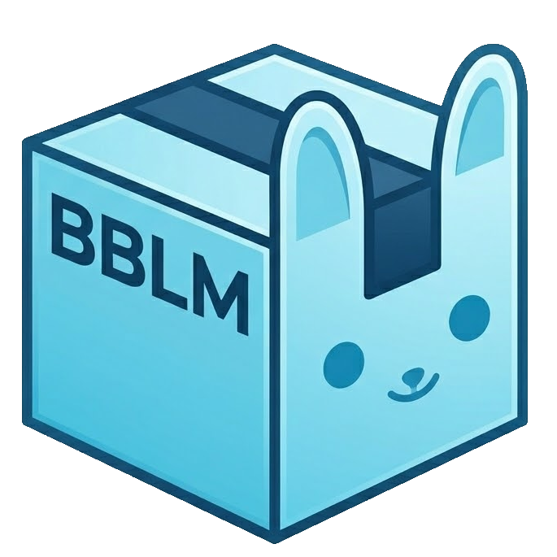

# BB's LibMan

<p align="center">
  
</p>

<p align="center">
  A desktop library manager for 3D models, VRChat avatars, and game assets — with deep Booth integration.
  <br />
  Built with Electron. Windows 10/11.
</p>

---

## Features

### 🗂 Library
- Browse all imported assets with thumbnail previews
- Switch between **Grid**, **List with thumbnail**, and **Compact** (no thumbnail) view modes
- Search assets by name and sort by date or alphabetically
- **Pagination** — configurable page size (10, 30, or 50 items per page)
- Asset counter in the toolbar showing total count, with a hover breakdown of local vs Booth items
- Modified cards **glow** briefly to highlight which asset was just changed or added

### 🏷 Tag System
- Assets can have multiple tags — local assets get tags from the import dialog, Booth items get them from their database
- When scraping a Booth URL, all item tags are fetched automatically from the Booth JSON API
- **Tag filter** — click the ⌖ Tags button to open a searchable tag panel; select one or more tags to filter the library (AND logic)
- Click any tag pill on a card to instantly filter by that tag
- Tags are editable at any time from the Edit dialog with autocomplete suggestions

### 📥 Importing Assets
- **Downloads Monitor** — watches your downloads folder and automatically opens the import dialog when a supported file is detected
- **Drag & Drop** — drag a file onto the window to choose between two actions:
  - **Add New Asset** (left zone) — opens the import dialog
  - **Add to Existing Asset** (right zone) — hover for 500ms to activate card drop targets, then drop the file directly onto any card to add it to that asset's folder without any dialog
  - Dragging the file back out of the window cancels the drop and dismisses the overlay
- **URL Scraping** — paste a Booth URL to automatically fetch the asset name, tags, and thumbnail via the Booth JSON API; other sites use HTML scraping
- **Multi-file imports** — select or drop several files at once:
  - With an **origin URL** set, all files are treated as one asset (e.g. an avatar plus its texture packs) and share the fetched name, tags, and thumbnail
  - With **no origin URL**, each file is imported as its own separate asset, named after its filename
- Thumbnails are downloaded and transcoded to 500×500 PNG at import time

### 🛍 Booth Library Manager Integration
- Connect your local [Booth Library Manager](https://booth.pm) database to display all your Booth purchases alongside your own imported assets
- Booth items show their original thumbnails with a Booth badge overlay in the bottom-left corner
- Booth item tags are read directly from the BLM database (`booth_item_tag_relations`)
- Clicking a Booth item opens its local download folder (if configured)
- Hover any card to reveal a **↗ open origin link** button in the bottom-right corner, opening the item's original listing in your browser
- Hide individual Booth items independently of your local library

### 🆓 Booth Free Items
A dedicated tab that automatically scans Booth.pm for ¥0 VRChat items:

- **Smart detection** — visits each item page and checks all variation prices, so items that are partially free (e.g. "¥0 – ¥300") are caught even when the listing shows a non-zero price
- **Price range display** — shows the full price range when an item has both free and paid tiers
- **Grid or List view** — switch between a compact list and a thumbnail grid, remembered across sessions
- **Paginated list** — thumbnail, name, and price shown in a clean 20-item paginated list; click any row to open the item on Booth
- **One-click download** — the Download button triggers the full download flow internally (no browser tab opens); a Booth login window appears automatically the first time if needed, and the session is remembered for all future downloads
- **"In Library" detection** — if an item is already in your BBLM library the button is automatically grayed out with "✔ In Library" text, updating live as downloads complete
- **Enable / disable toggle** — turn the entire Free Items feature on or off without losing your settings
- **Auto-scan** — configure an interval (1–24 hours) to scan automatically in the background, or trigger a manual scan at any time
- **Configurable depth** — set how many listing pages to scan (default 5, max 20)
- **Polite scraping** — 3–5 second random delay between item page requests to avoid overloading Booth's servers

### 🔍 Library Scanner
A utility tab for discovering assets already on your disk that haven't been imported yet:

- **Folder scan** — pick any folder and scan it recursively for archives and Unity packages
- **Paginated results** — found files listed 10 at a time with archive name, contained files, and full path
- **One-click import** — import any discovered file directly into BBLM without leaving the tab
- **Copy All** — copy the full list of found paths to the clipboard in one click
- **Progress bar** — real-time scan progress shown while scanning large folder trees
- **Cancellable** — stop a long scan at any time

### 🛡 Malware Scanning
Imported files are checked in the background with the [vrchat-scanner](https://github.com/vicentefelipechile/vrchat-scanner) CLI, which BBLM downloads and keeps up to date automatically:

- **Automatic scan on import** — `.unitypackage`, `.zip`, `.rar`, and `.7z` files are scanned as soon as an import finishes
- **Flagged asset modal** — a warning popup with the scan output appears for anything above a clean result, with **Mark as Safe** / **Mark as Unsafe** actions
- **Threat filter** — click **⚠ Threat** in the library header to filter by scan result
- **Idle backlog sweep** — assets already in your library that haven't been scanned are checked one at a time, only after the computer has been idle for a few minutes
- **Scan All Assets Now** — trigger a full-library scan on demand from Settings
- Auto-scan-on-import and the idle sweep can each be disabled independently in Settings

### 🎮 Unity Project Import
Copy files straight from an imported asset into an open Unity project, including files nested inside archives:

- Install the companion package (`companion/unity/BBLM_Importer.unitypackage`) into a Unity project once — BBLM then detects that project is open automatically
- Right-click any asset with an archive or `.unitypackage` file and choose **Add to project**
- Pick which files to copy (with search and select-all) and, if more than one project is open, which one to target
- `.unitypackage` files are dropped into the target project for Unity to import on its own; other files are copied directly into the project

### 🔞 Adult Content Filter
- Items marked adult by the Booth API are flagged automatically
- Toggle **🔞 Show All** in the library header to hide or reveal them

### 📰 Release Notes
- After an automatic update, a popup summarizes what changed in the new version, pulled from the changelog
- Revisit it anytime from **Settings → About → Show Release Notes**

### 🔗 URL Protocol Handlers
Register BB's LibMan as the default handler for custom URL schemes, enabling fully automatic one-click importing from external apps:

| Scheme | App |
|---|---|
| `booth-library-manager://` | Booth Library Manager |
| `vroid.closet://` | VRoid Closet |
| `BunsLM://` | Custom / companion scripts |

When a supported link is triggered, BB's LibMan:
1. Immediately scrapes the Booth page for name, tags, and thumbnail — the asset card appears in the library right away
2. Downloads the file in the background with a per-card progress bar
3. Moves the file into the asset folder and marks the card complete
4. Shows a system notification when done

Multiple links triggered in quick succession are handled by a **download queue** — one download runs at a time, with a footer indicator showing the active download progress and how many items are waiting.

### ✏️ Asset Management
- **+ Add Asset button** — quick-access button in the toolbar to open the import dialog without drag-drop
- **Single click** — opens the Edit dialog to update name, origin URL, tags, or thumbnail
- **Double click** — opens the asset folder in Explorer
- **Right-click** — context menu with Edit, Hide, and Delete options
- **Hide** — remove an asset from the library view without deleting it; restore it from Settings → Hidden Assets
- **Delete** — permanently delete an asset and all its files

### 🔄 Automatic Updates
- On launch, BB's LibMan checks GitHub Releases for a newer version, downloads it silently in the background, and installs it the next time the app quits — no manual download needed

### 🔔 Notifications
- Desktop notifications for completed and failed downloads, toggleable in Settings

### 🖥 System Tray
- Minimizing or closing the window sends the app to the system tray
- The app keeps running in the background, monitoring downloads
- Double-click the tray icon or use the right-click menu to restore or quit

---

## Supported Asset Sites

Smart folder naming extracts store and asset slugs from known URLs:

| Site | Folder format |
|---|---|
| Gumroad (`*.gumroad.com/i/<asset>`) | `storename.asset` |
| Jinxxy (`jinxxy.com/<store>/<asset>`) | `storename.asset` |
| Booth.pm and others | `asset-slug` |

---

## Supported File Types

Archives, Unity packages, and common 3D formats are detected automatically by the downloads monitor:

`zip` `rar` `7z` `tar` `gz` `unitypackage` `uasset` `blend` `fbx` `obj` `max` `ma` `mb` `stl` `gltf` `glb` `usd` `usda` `usdc` `abc` `dae`

---

## Requirements

- [Node.js](https://nodejs.org) v18 or later
- Windows 10 / 11

---

## Installation

```bash
# Clone the repo
git clone https://github.com/BunBnnuy/BBLM.git
cd BBLM

# Install dependencies
npm install
```

---

## Running

### Development (debug mode)
Launches the app with the Node.js inspector on port **5858**.

```bash
npm run dev
```

Attach the main-process debugger at `chrome://inspect` → Configure → `localhost:5858`.

### Production
```bash
npm start
```

---

## Testing

```bash
npm test        # regression suite (node --test)
npm run lint     # ESLint
npm run check    # lint + test + production dependency audit
```

---

## Building a Distributable

Produces a Windows NSIS installer in `dist/`.

```bash
npm run build
```

> **Note:** The first build downloads the Electron binary if it isn't cached — this may take a few minutes.

---

## First-Time Setup

1. Launch the app
2. Click **⚙ Settings**
3. Set your **Root Folder** — all imported assets are organised here
4. Set your **Downloads Folder** — where your browser saves files (defaults to `~/Downloads`)
5. Enable the **Downloads Monitor** toggle
6. Click **Save Settings**

From now on, whenever a supported file finishes downloading the import dialog opens automatically.

### Optional: Booth Library Manager
1. In Settings, enable **Include Booth Library Manager**
2. Set your **Booth LM Download Folder** (where Booth Library Manager saves files)
3. Save — your Booth purchases will appear in the library alongside your local assets

### Optional: URL Protocol Handlers
In Settings → **URL Schemes**, toggle on any scheme to register BB's LibMan as the default handler. After enabling, clicking download links in Booth Library Manager or VRoid Closet will trigger a fully automatic import — no dialogs needed.

---

## Project Structure

```
├── main.js                  # Electron main process + download queue
├── preload.js               # Context bridge (main window ↔ renderer)
├── preload-modal.js         # Context bridge (import/edit modal ↔ renderer)
├── src/
│   ├── assetManager.js      # Import, update, delete, shell creation, meta.json
│   ├── assetTransaction.js  # Staged, all-or-nothing asset import/update commits
│   ├── atomicFs.js          # Atomic JSON writes + staging directory cleanup
│   ├── archiveScanner.js    # Library Scanner policy (limits, preflight)
│   ├── scannerWorker.js     # Sandboxed archive-listing child process
│   ├── boothFreeScraper.js  # Booth free-item scanner (listing + per-page variation check)
│   ├── downloadsMonitor.js  # fs.watch + file stability poller
│   ├── fileWatcher.js       # One-shot file wait (manual import)
│   ├── httpClient.js        # Shared HTTPS client (DNS-pinned, redirect/size/time limits)
│   ├── logger.js            # Redacted structured logging
│   ├── malwareScan.js       # Forked-worker scan runner for imported assets
│   ├── malwareScanWorker.js # Sandboxed vrchat-scanner CLI invocation
│   ├── malwareScanner.js    # Downloads/updates the vrchat-scanner binary
│   ├── protocol.js          # Strict parsers for custom URL schemes
│   ├── releaseNotes.js      # Parses CHANGELOG.md for the release notes popup
│   ├── scraper.js           # Booth JSON API + HTML scraper (title, images, tags)
│   ├── unityImport.js       # Archive-aware file picker/copier for Unity import
│   └── security/            # Path containment and outbound network policy
├── renderer/
│   ├── index.html / app.js          # Main library view + pagination + tag filter
│   ├── freeItems.js                 # Booth Free Items tab logic
│   ├── scanner.js                   # Library Scanner tab logic
│   ├── modal.html / modal.js        # Import / edit dialog with tag editor
│   ├── releaseNotes.js              # Release notes popup rendering
│   ├── settings.html / settings.js  # Settings page
│   └── styles.css
├── assets/
│   ├── icon.png
│   └── booth.png
├── test/                    # node --test regression suite
└── companion/
    ├── RSLimMan.user.js               # Tampermonkey companion script (optional)
    └── unity/
        ├── BBLM_Importer.cs           # Unity Editor script (project detection + auto-import)
        ├── BBLM_Importer.unitypackage # Prebuilt package to import into a Unity project
        └── build-unitypackage.js      # Regenerates the .unitypackage from the .cs (dev tool)
```

---

## Asset Folder Structure

Each imported asset gets its own folder inside the root folder:

```
<root>/
└── storename.asset-slug/
    ├── asset-file.zip       # The original downloaded file
    ├── thumbnail.png        # 500×500 PNG thumbnail
    └── meta.json            # Name, origin URL, import date, tags, download status
```

---

## Changelog

See [CHANGELOG.md](CHANGELOG.md) for the full version history.

---

## License

MIT © 2026 BunBnnuy — see [LICENSE](LICENSE) for full text.

## Open Source

BB's LibMan is built on:

- [Electron](https://www.electronjs.org/) — MIT
- [electron-store](https://github.com/sindresorhus/electron-store) — MIT
- [sql.js](https://github.com/sql-js/sql.js) — MIT
- [sharp](https://sharp.pixelplumbing.com/) — Apache-2.0
- [cheerio](https://cheerio.js.org/) — MIT
- [electron-builder](https://www.electron.build/) — MIT

---

<p align="center">Made with ♥ for R.S. by BunBnnuy</p>
